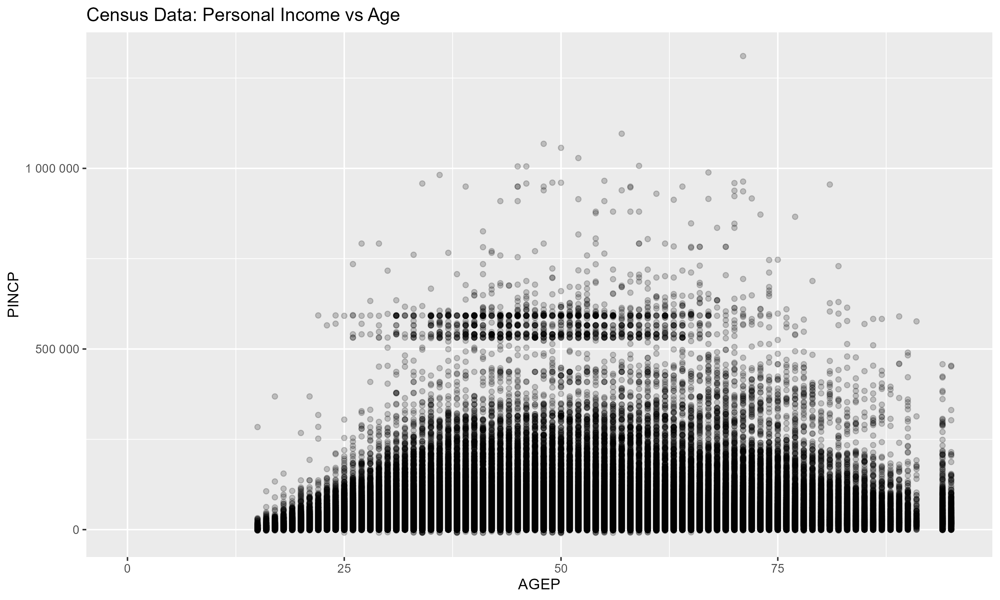
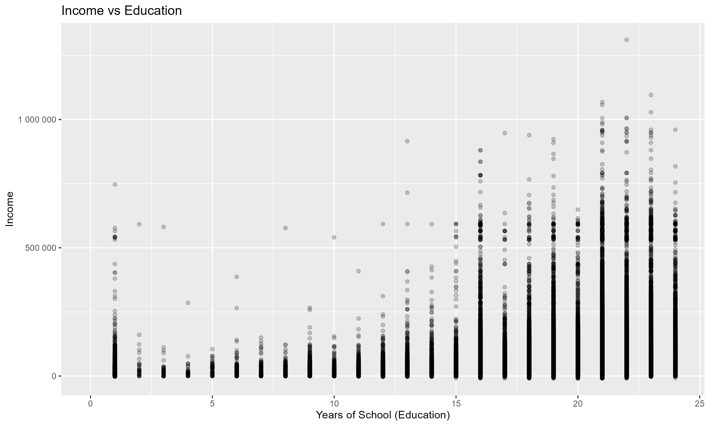
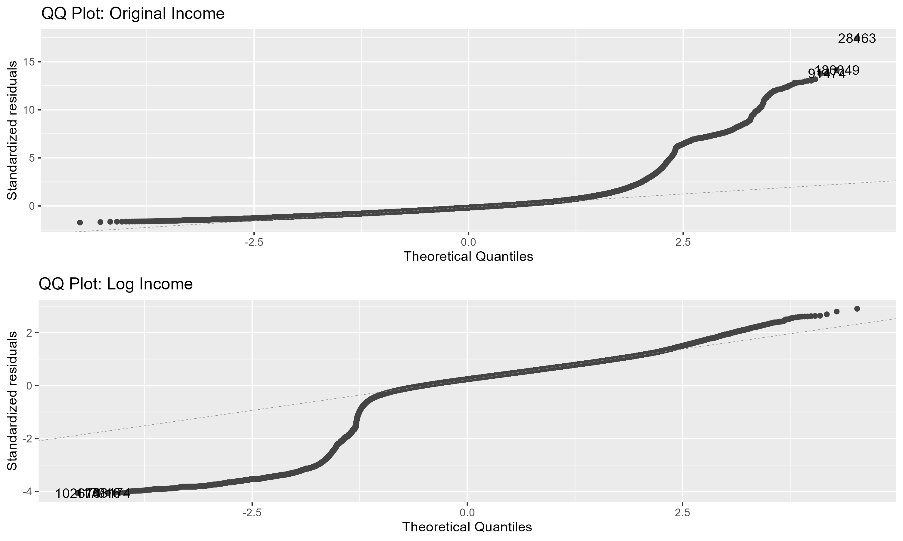
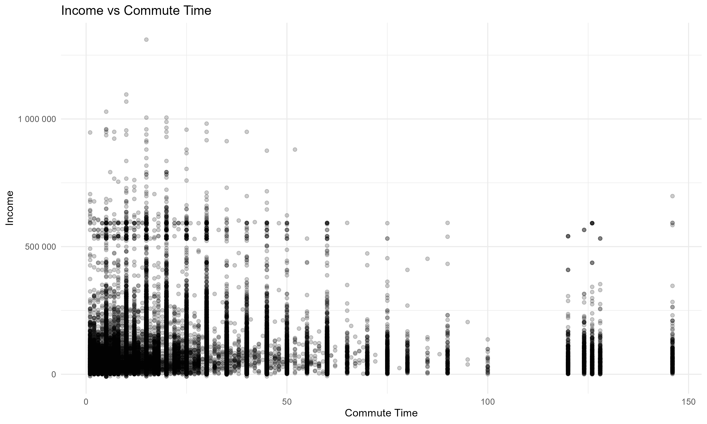
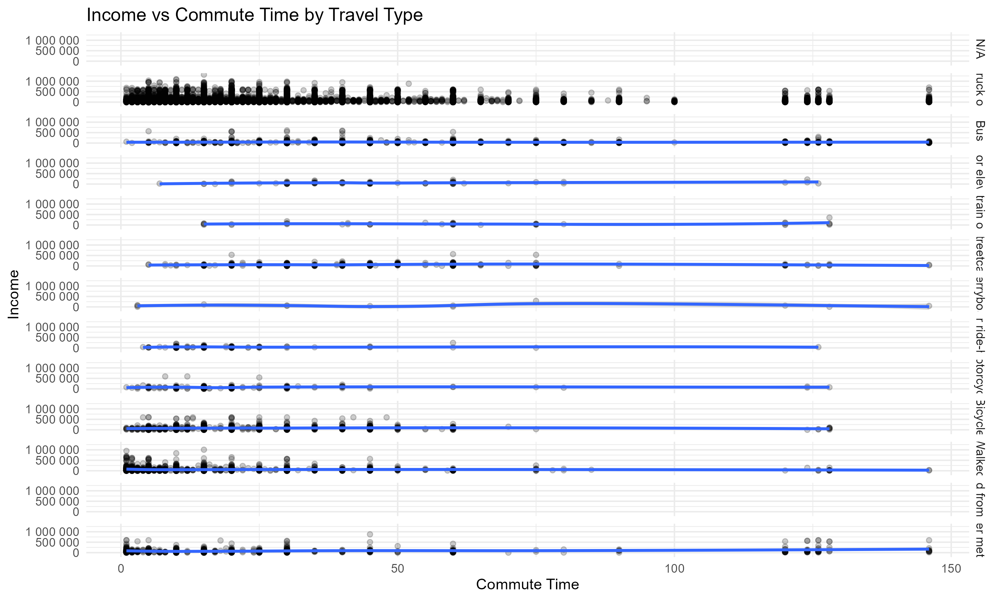
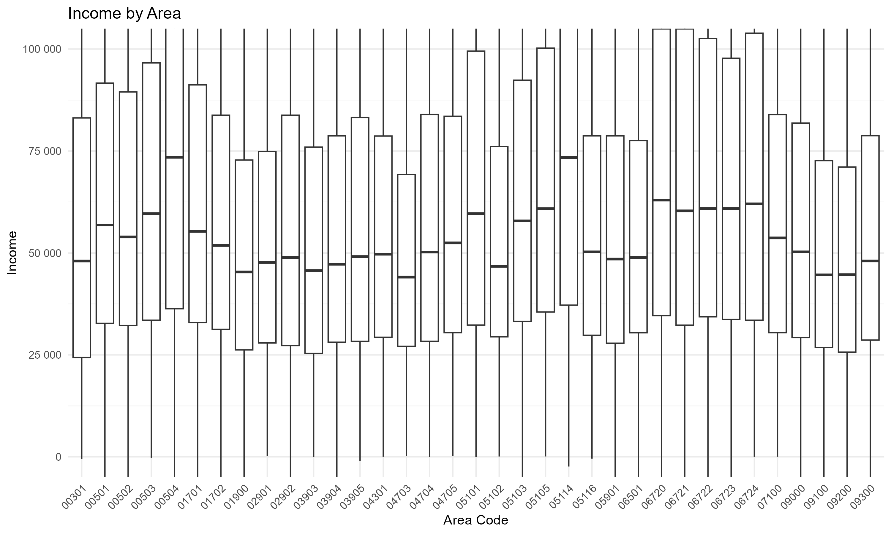

```{r}
#| label: document settings
#| include: false
knitr::opts_chunk$set(
  warning = FALSE,
  message = FALSE)
```

```{r}
#| label: load in packages
#| include: false
#| warning: false

#install.packages("ggfortify")

library(tidyverse)
library(patchwork)
library(ggplot2)
library(ggfortify)
library(glmnet)
library(faraway)
library(car)
library(gt)
library(scales)
library(survey)
```

## Introduction

This report analyzes individual-level data for Oregon residents from the 2020–2024 American Community Survey (ACS) 5-year Public Use Microdata Sample (PUMS) (1). The ACS PUMS provides a representative subsample of the U.S. population with detailed demographic, socioeconomic, and labor market information, enabling analysis at the individual level while preserving confidentiality. All analyses account for the survey design through the use of person weights, and income measures are adjusted to constant dollars using the Census Bureau’s adjustment factor.

Following the OSEMN (Obtain, Scrub, Explore, Model, and Interpret) framework (2), we conduct exploratory analyses and develop statistical models to examine relationships between key variables of interest. The primary focus of this report is to identify factors associated with income and other socioeconomic outcomes in Oregon. Specifically, we investigate (1) predictors of income using penalized linear regression, (2) individual characteristics associated with lacking health insurance coverage, and (3) the relationship between income and transportation-related factors such as commute time, vehicle access, and location. These analyses aim to provide insight into the demographic and structural factors that contribute to economic outcomes within the state.

```{r}
#| label: install-deps
#| include: false
# reticulate::virtualenv_create("r-reticulate")
# reticulate::virtualenv_install("r-reticulate", c("requests", "pandas"))
```

```{r}
#| label: add-reticulate
#| include: false
# file.edit("~/.Rprofile")
# add in this 
# Sys.setenv(RETICULATE_PYTHON_ENV = "r-reticulate")
```

```{r}
#| label: optional-pyrestart
#| include: false
# run the following restart the python session if needed
# reticulate::py_run_string("import gc; gc.collect()")
```

```{python}
#| label: fetch-metadata
#| include: false # removed from our output
#| cache: false

import requests
import json
from pathlib import Path

METADATA_PATH = Path("data/pums_variables_metadata.json")

variables = [ # added POBP, JWTRNS, NRC
    "WAGP", "PINCP", "PERNP", "POVPIP", "HICOV", "ESR",
    "AGEP", "SEX", "RAC1P", "HISP", "CIT", "YOEP", "MAR", "RELSHIPP",
    "POBP", "SCHL", "FOD1P", "SCH", "COW", "WKHP", "WKWN", "NAICSP", "OCCP", 
    "WRK", "JWMNP", "JWTRNS", "PUMA", "MIG", "MIGSP", "POWSP",
    "DIS", "DPHY", "DREM", "DEAR", "DEYE","HINCP", "HHT", "TEN", "VEH",
    "NRC", "RETP", "SSP", "SSIP", "PAP", "SEMP",
    "PWGTP", "ADJINC",
]

BASE_URL = "https://api.census.gov/data/2024/acs/acs1/pums/variables/{}.json"

if METADATA_PATH.exists():
    print(f"Loading metadata from cache: {METADATA_PATH}")
    with open(METADATA_PATH) as f:
        metadata = json.load(f)
else:
    print("Fetching variable metadata from Census API...")
    METADATA_PATH.parent.mkdir(parents=True, exist_ok=True)
    metadata = {}

    for var in variables:
        response = requests.get(BASE_URL.format(var), timeout=30)
        if response.status_code == 200:
            metadata[var] = response.json()
            print(f"  OK: {var}")
        else:
            print(f"  FAILED: {var} — {response.status_code}")

    with open(METADATA_PATH, "w") as f:
        json.dump(metadata, f, indent=2)

    print(f"\nSaved metadata for {len(metadata)} variables to {METADATA_PATH}")

# Preview one variable
print(json.dumps(metadata.get("WAGP", {}), indent=2))
```

```{python}
#| label: fetch-pums
#| include: false
#| cache: false

# --- Scrub Start ---

import requests
import pandas as pd
from pathlib import Path

API_KEY = "a8f34453c39e419470f405353250f662a508d821"
YEAR = 2024
STATE = "41"
CACHE_PATH = Path("data/pums_oregon_2024.csv")

variables = [
    # Outcomes
    "WAGP", "PINCP", "PERNP", "POVPIP", "HICOV", "ESR",
    # Core demographics
    "AGEP", "SEX", "RAC1P", "HISP", "CIT", "YOEP", "MAR", "RELSHIPP",
    "POBP",                                                       # added POBP
    # Education
    "SCHL", "FOD1P", "SCH",
    # Labor market
    "COW", "WKHP", "WKWN", "NAICSP", "OCCP", "WRK", "JWMNP", "JWTRNS", # added
    # Geography
    "PUMA", "MIG", "MIGSP", "POWSP",
    # Disability & health
    "DIS", "DPHY", "DREM", "DEAR", "DEYE",
    # Household context
    "HINCP", "HHT", "TEN", "VEH", "NRC",                            # added NRC
    # Income components
    "RETP", "SSP", "SSIP", "PAP", "SEMP",
    # Weights & adjustments
    "PWGTP", "ADJINC","NP",
]

if CACHE_PATH.exists():
    print(f"Loading from local cache: {CACHE_PATH}")
    pums = pd.read_csv(CACHE_PATH, low_memory=False)
    print(f"Loaded: {len(pums):,} rows, {pums.shape[1]} columns")
else:
    print(f"Cache not found — fetching from Census API...")
    CACHE_PATH.parent.mkdir(parents=True, exist_ok=True)
    url = (
        f"https://api.census.gov/data/{YEAR}/acs/acs5/pums"
        f"?get={','.join(variables)}"
        f"&for=state:{STATE}"
        f"&key={API_KEY}"
    )
    response = requests.get(url, timeout=60)
    print(f"Status code: {response.status_code}")
    if response.status_code == 200:
        data = response.json()
        pums = pd.DataFrame(data[1:], columns=data[0])
        pums.to_csv(CACHE_PATH, index=False)
        print(f"Saved to {CACHE_PATH}: {len(pums):,} rows, {pums.shape[1]} columns")
    else:
        print(f"Error: {response.text[:500]}")
```

```{r}
#| label: load-pums
#| include: false

pums <- read_csv("data/pums_oregon_2024.csv", show_col_types = FALSE)

#glimpse(pums)
```

```{r}
#| label: scrub-pums
#| echo: false
#| cache: true

pums_clean <- pums |>

  # --- Remove group quarters records ---
  filter(HINCP != -60000) |>

  # --- Apply income adjustment factor ---
  mutate(
    across(c(WAGP, PINCP, PERNP, HINCP, RETP, SSP, SSIP, PAP, SEMP),
           ~ .x * ADJINC)
  ) |>

  # --- Recode all N/A sentinels to NA ---
  mutate(
    # Income vars: age-based N/A
    WAGP   = na_if(WAGP,  -1 * ADJINC),
    PERNP  = na_if(PERNP, -10001 * ADJINC),
    PINCP  = na_if(PINCP, -19999 * ADJINC),
    RETP   = na_if(RETP,  -1 * ADJINC),
    SSP    = na_if(SSP,   -1 * ADJINC),
    SSIP   = na_if(SSIP,  -1 * ADJINC),
    PAP    = na_if(PAP,   -1 * ADJINC),
    SEMP   = na_if(SEMP,  -10001 * ADJINC),
    # Labor market: 0 = N/A (under 16 or did not work)
    WKHP   = na_if(WKHP, 0),
    WKWN   = na_if(WKWN, 0),
    JWMNP  = na_if(JWMNP, 0),
    # Other sentinels
    POVPIP = na_if(POVPIP, -1),
    ESR    = na_if(ESR, 0),
    YOEP   = na_if(YOEP, 1937),
    HHT    = na_if(HHT, 0),
    TEN    = na_if(TEN, 0),
    VEH    = na_if(VEH, -1),
    NRC    = na_if(NRC, -1),
    DPHY   = na_if(DPHY, 0),
    DREM   = na_if(DREM, 0),
    NP     = na_if(NP, 0),
    # Labor class and work status: 0 = N/A
    COW    = na_if(COW, 0),
    WRK    = na_if(WRK, 0),
  ) |>

  # --- Recode binary vars to logical (1=Yes, 2=No) ---
  mutate(
    across(c(DPHY, DREM, DEAR, DEYE, DIS), ~ .x == 1),
    HICOV = HICOV == 1,
  ) |>

  # --- Recode categorical vars as factors with labels from metadata ---
  mutate(
    SEX = factor(SEX, levels = c(1, 2),
                 labels = c("Male", "Female")),

    RAC1P = factor(RAC1P, levels = 1:9,
                   labels = c("White alone", "Black or African American alone",
                              "American Indian alone", "Alaska Native alone",
                              "AIAN tribes specified", "Asian alone",
                              "Native Hawaiian and Other Pacific Islander alone",
                              "Some other race alone", "Two or More Races")),

    HISP_binary = factor(if_else(HISP == "01", "Not Hispanic", "Hispanic")),

    CIT = factor(CIT, levels = 1:5,
                 labels = c("Born in US", "Born in PR/territories",
                            "Born abroad of US citizen parent",
                            "Naturalized citizen", "Not a US citizen")),

    MAR = factor(MAR, levels = 1:5,
                 labels = c("Married", "Widowed", "Divorced",
                            "Separated", "Never married")),

    ESR = factor(ESR, levels = 1:6,
                 labels = c("Civilian employed at work",
                            "Civilian employed not at work",
                            "Unemployed",
                            "Armed Forces at work",
                            "Armed Forces not at work",
                            "Not in labor force")),

    SCH = factor(SCH, levels = 1:3,
                 labels = c("Not enrolled", "Public school", "Private school")),

    COW = factor(COW, levels = 1:9,
                 labels = c("Private for-profit", "Private nonprofit",
                            "Local govt", "State govt", "Federal govt",
                            "Self-emp incorporated", "Self-emp not incorporated",
                            "Working without pay", "Unemployed last 5 years")),

    MIG = factor(MIG, levels = 1:3,
                 labels = c("Same house", "Outside US", "Different house in US")),

    HHT = factor(HHT, levels = 1:7,
                 labels = c("Married couple household",
                            "Other family: male householder no spouse",
                            "Other family: female householder no spouse",
                            "Nonfamily: male householder living alone",
                            "Nonfamily: male householder not living alone",
                            "Nonfamily: female householder living alone",
                            "Nonfamily: female householder not living alone")),

    TEN = factor(TEN, levels = 1:4,
                 labels = c("Owned with mortgage", "Owned free and clear",
                            "Rented", "Occupied without payment")),

    WRK = factor(WRK, levels = 1:2,
                 labels = c("Worked last week", "Did not work last week")),

    JWTRNS = factor(JWTRNS, levels = 0:12,
                    labels = c("N/A", "Car truck or van", "Bus",
                               "Subway or elevated rail",
                               "Long-distance train or commuter rail",
                               "Light rail streetcar or trolley",
                               "Ferryboat", "Taxi or ride-hailing",
                               "Motorcycle", "Bicycle", "Walked",
                               "Worked from home", "Other method")),

    POBP_binary = factor(case_when(
      as.numeric(POBP) <= 56  ~ "Born in US",
      as.numeric(POBP) == 72  ~ "Born in PR/territories",
      TRUE                    ~ "Foreign born"
    )),
  ) |>

  # --- Drop redundant/replaced columns ---
  select(-ADJINC, -HISP, -POBP, -state) |>

  # --- Ensure valid person weight ---
  filter(!is.na(PWGTP), PWGTP > 0)

#glimpse(pums_clean)
```


```{r}
#| label: eda-overview
#| include: false

# --- Note ---
# after data pull and scrub in Python from the API
# the following was a proposed EDA method
# the group did chose to work in a different direction for EDA
# we have left if here for possible future use

library(tidyverse)
library(skimr)

# 1. overall summary
#skim(pums_clean)
```

```{r}
#| label: eda-missingness
#| include: false
```

```{r}
#| label: eda-income-distributions
#| include: false

# Wages among earners only

# Log wages

# Total personal income
```

```{r}
#| label: eda-outcome-summaries
#| include: false

# Q1/Q3: wage statistics by key groups

# Q2: health insurance coverage rate

# Q2: uninsured rate by citizenship
```

```{r}
#| label: eda-categorical-distributions
#| include: false
```

```{r}
#| label: eda-continuous-distributions
#| include: false
```

```{r}
#| label: eda-correlations
#| include: false

# --- End EDA proposal ---

library(corrr)
```

## Question 1: Can income be predicted from selected census variables?

## Exploratory Data Analysis: Question 1

We begin by exploring the relationship between income and a few key predictors: age, education, gender, race, place of birth and number of household members.

```{r}
#| label: eda-histograms
#| echo: false
#| warning: false
p1 <-ggplot(data = pums_clean, aes(x = PINCP)) +
  geom_histogram(binwidth = 30000) + 
  labs(
    y = "Count",
    x = "Personal Income"
  )


p2 <-ggplot(data = pums_clean, aes(x = log(pums_clean$PINCP)+1)) +
  geom_histogram(binwidth = 1) + 
  labs(
    y = "Count",
    x = "log() of Personal Income"
  )

p1 + p2 + plot_layout(ncol = 2)
```

```{r}
#| label: eda-incomevage
#| echo: false
#| include: false

# This takes a long time to run, adding if statement
# so it only gets run when needed.
outfile <- "./eda-incomevage-plot.png"

if (!file.exists(outfile)) {
  incomevage_plot <- ggplot(pums_clean, aes(x = AGEP, y = PINCP)) +
    geom_point(alpha = 0.2) +
    geom_smooth(method = "loess") +
    scale_y_continuous(labels = label_number()) +
    labs(title = "Census Data: Personal Income vs Age")
    ggsave(outfile, plot = incomevage_plot, width = 10, height = 6, dpi = 300)
}
```



The above summary statistics indicate that income (PINCP) is highly right-skewed, with a small number of individuals earning substantially more than the median. Because of this skewness, we applied a log transformation to the income response when evaluating linear model fit for the final report. The scatterplot of income versus age suggests a nonlinear relationship: income tends to increase with age early in life, plateau in middle age, and decline slightly at older ages. This pattern suggests the inclusion of a quadratic age term in the regression model.

```{r}
#| label: eda-incomeved
#| echo: false
#| include: false
#| warning: false

# This takes a long time to run, adding if statement
# so it only gets run when needed.
outfile <- "./eda-incomeved-plot.png"

if (!file.exists(outfile)) {
  incomeved_plot <- ggplot(pums_clean, aes(x = SCHL, y = PINCP)) +
    geom_point(alpha = 0.2) +
    geom_smooth(method = "loess") +
    scale_y_continuous(labels = label_number()) +
    labs(title = "Income vs Education", x = "Years of School (Education)", y = "Income")
  ggsave(outfile, plot = incomeved_plot, width = 10, height = 6, dpi = 300)
}
```



```{r}
#| label: eda-incomevgender
#| echo: false
#| warning: false
ggplot(pums_clean, aes(x = factor(SEX), y = PINCP)) +
  geom_boxplot() +
  coord_cartesian(ylim = c(0, 200000)) +
  scale_x_discrete(labels = c("Male", "Female")) +
  labs(
    title = "Income by Gender",
    x = "Gender",
    y = "Income"
  ) +
  theme_minimal()
ggsave("./eda-incomevgender-plot.png", width = 10, height = 6, dpi = 300)
```


```{r}
#| label: eda-incomevrace
#| echo: false
#| warning: false
ggplot(pums_clean, aes(x = factor(RAC1P), y = PINCP)) +
  geom_boxplot() +
  coord_cartesian(ylim = c(0, 200000)) +
  labs(
    title = "Income by Race",
    x = "Race",
    y = "Income"
  ) +
  theme_minimal() +
  theme(axis.text.x = element_text(angle = 45, hjust = 1)) +
  scale_x_discrete(labels = c(
    "White alone" = "White",
    "Black or African American alone" = "Black",
    "American Indian alone" = "AIAN",
    "Alaska Native alone" = "Alaska Nat.",
    "AIAN w/ tribes specified" = "AIAN (tribe)",
    "Asian alone" = "Asian",
    "Native Hawaiian and Other Pacific Islander alone" = "NHPI",
    "Some other race alone" = "Other",
    "Two or More Races" = "Two or More Races"
  ))
ggsave("./eda-incomevrace-plot.png", width = 10, height = 6, dpi = 300)
```

attainment corresponding to higher earnings. Boxplots of income by gender and race reveal differences in median income across groups, supporting their inclusion as categorical predictors. Overall, the exploratory analysis suggests that income is influenced by multiple demographic and socioeconomic factors, and that nonlinear effects, particularly for age, should be incorporated into the model.

## Exploratory Data Analysis: Question 2
We use the full Oregon sample from pums_clean (all ages and labor force statuses) to capture coverage gaps among non-citizens, including those outside the workforce. After dropping missing values for insurance (HICOV), income (POVPIP), and citizenship (CIT), the final sample includes 197,991 residents.

The outcome is being uninsured (1 = uninsured, 0 = insured). Income is measured with POVPIP (percent of the poverty line), aligning with Medicaid and ACA thresholds. Education (SCHL) is grouped into six levels, and employment (ESR_group) into five categories to separate labor force from citizenship effects. Household size (NP), full citizenship categories (CIT), and controls for age, race, and Hispanic origin are also included.

The exploratory analysis reveals a stark and consistent coverage gap by citizenship status. Non-citizens in Oregon are uninsured at roughly 26% — about 21 percentage points higher than US-born residents, whose rate sits between 4–9% across all citizen categories (Figure 1). Income matters: uninsured residents are concentrated below 200% of the poverty line, and POVPIP clearly tracks coverage status (Figure 2). But income tells only part of the story — uninsured individuals appear at every income level, particularly in the 200–400% range, suggesting other forces are at work. Figure 3 makes this plain. Even among the employed, where employer-sponsored coverage is most accessible, non-citizens are uninsured at ~27% compared to ~6% for US-born workers — a gap of over 20 percentage points within the same employment category. Unemployed non-citizens face compounding disadvantage at ~42%, excluded simultaneously from employer coverage and from many public programs available to citizens in identical economic circumstances. The pattern holds across income levels, employment groups, and labor force status: citizenship status appears to independently shape access to health insurance in Oregon, over and above socioeconomic position. The regression models that follow test whether this gap persists after controlling for income, education, employment, household size, age, race, and Hispanic origin.

```{r}
#| label: q2-occp-lookup
#| include: false
#| cache: true

# build OCCP group lookup on distinct codes only
occp_groups <- pums_clean |>
  filter(OCCP != "N", !is.na(OCCP)) |>
  distinct(OCCP) |>
  mutate(
    OCCP_group = case_when(
      between(suppressWarnings(as.numeric(OCCP)), 10,   960)  ~ "High coverage",
      between(suppressWarnings(as.numeric(OCCP)), 1005, 2555) ~ "High coverage",
      between(suppressWarnings(as.numeric(OCCP)), 3000, 3550) ~ "High coverage",
      between(suppressWarnings(as.numeric(OCCP)), 2600, 2920) ~ "Variable coverage",
      between(suppressWarnings(as.numeric(OCCP)), 3600, 3655) ~ "Variable coverage",
      between(suppressWarnings(as.numeric(OCCP)), 4330, 5940) ~ "Variable coverage",
      between(suppressWarnings(as.numeric(OCCP)), 4000, 4255) ~ "Low coverage",
      between(suppressWarnings(as.numeric(OCCP)), 6005, 6130) ~ "Low coverage",
      between(suppressWarnings(as.numeric(OCCP)), 6200, 8990) ~ "Low coverage",
      between(suppressWarnings(as.numeric(OCCP)), 9005, 9760) ~ "Low coverage",
      between(suppressWarnings(as.numeric(OCCP)), 3700, 3960) ~ "Military & Protective",
      between(suppressWarnings(as.numeric(OCCP)), 9800, 9830) ~ "Military & Protective",
      TRUE                                                     ~ "Variable coverage"
    ),
    OCCP_group = factor(OCCP_group,
                        levels = c("High coverage", "Variable coverage",
                                   "Low coverage", "Military & Protective"))
  )

# check
cat("Distinct OCCP codes mapped:", nrow(occp_groups), "\n")
count(occp_groups, OCCP_group)
```
```{r}
#| label: q2-prep
#| include: false
#| cache: false

pums_q2 <- pums_clean |>
  left_join(occp_groups, by = "OCCP") |>
  mutate(
    # response: uninsured
    UNINSURED = as.integer(!HICOV),

    # education collapsed to degree attainment groups
    SCHL_group = case_when(
      SCHL <= 15           ~ "Less than high school",
      SCHL %in% c(16, 17) ~ "High school or GED",
      SCHL %in% c(18, 19) ~ "Some college",
      SCHL == 20           ~ "Associate's degree",
      SCHL == 21           ~ "Bachelor's degree",
      SCHL >= 22           ~ "Graduate degree"
    ),
    SCHL_group = factor(SCHL_group,
                        levels = c("Less than high school", "High school or GED",
                                   "Some college", "Associate's degree",
                                   "Bachelor's degree", "Graduate degree")),

    # employment status collapsed
    # separates labor force status from citizenship for cleaner interpretation
    ESR_group = case_when(
      is.na(ESR)                                          ~ "Under 16",
      ESR == "Civilian employed at work"                  ~ "Employed",
      ESR == "Civilian employed not at work"              ~ "Employed",
      ESR == "Unemployed"                                 ~ "Unemployed",
      ESR %in% c("Armed Forces at work",
                 "Armed Forces not at work")              ~ "Armed Forces",
      ESR == "Not in labor force"                         ~ "Not in labor force"
    ),
    ESR_group = factor(ESR_group,
                       levels = c("Employed", "Unemployed",
                                  "Not in labor force", "Armed Forces",
                                  "Under 16")),

    # age groups for descriptive EDA
    AGE_group = case_when(
      AGEP < 18              ~ "Under 18",
      between(AGEP, 18, 25)  ~ "18-25",
      between(AGEP, 26, 34)  ~ "26-34",
      between(AGEP, 35, 44)  ~ "35-44",
      between(AGEP, 45, 54)  ~ "45-54",
      between(AGEP, 55, 64)  ~ "55-64",
      AGEP >= 65             ~ "65+"
    ),
    AGE_group = factor(AGE_group,
                       levels = c("Under 18", "18-25", "26-34", "35-44",
                                  "45-54", "55-64", "65+"))
  ) |>
  filter(!is.na(HICOV), !is.na(POVPIP), !is.na(CIT))

cat("Q2 analytic sample:", nrow(pums_q2), "residents\n")
cat("Unweighted uninsured rate:",
    round(mean(pums_q2$UNINSURED) * 100, 1), "%\n")
```
```{r}
#| label: q2-survey-design
#| include: false
#| cache: false

# define survey design
svy_q2 <- svydesign(
  ids     = ~PUMA,
  weights = ~PWGTP,
  data    = pums_q2,
  nest    = TRUE
)

cat("Weighted population uninsured rate:",
    round(svymean(~UNINSURED, svy_q2)[[1]] * 100, 1), "%\n\n")
```
```{r}
#| label: q2-theme-setup
#| echo: false
#| cache: false

library(ggplot2)
library(dplyr)
library(stringr)

q2_theme <- theme_classic() +
  theme(
    plot.title    = element_text(size = 12, face = "bold"),
    plot.subtitle = element_text(size = 9, color = "gray40"),
    axis.text.y   = element_text(size = 8),
    axis.text.x   = element_text(size = 8),
    plot.margin   = margin(10, 30, 10, 10)
  )
```
```{r}
#| label: q2-eda-citizenship
#| echo: false
#| cache: true

# uninsured rate by citizenship
# visualize citizenship gap
svyby(~UNINSURED, ~CIT, svy_q2, svymean) |>
  mutate(
    pct_uninsured = UNINSURED * 100,
    ci_lower      = (UNINSURED - 1.96 * se) * 100,
    ci_upper      = (UNINSURED + 1.96 * se) * 100,
    CIT           = reorder(CIT, pct_uninsured)
  ) |>
  ggplot(aes(x = CIT, y = pct_uninsured,
             ymin = ci_lower, ymax = ci_upper)) +
  geom_col(fill = "gray", alpha = 0.8) +
  geom_errorbar(width = 0.2) +
  coord_flip() +
  labs(
    title    = "Uninsured Rate by Citizenship Status (weighted)",
    subtitle = "Oregon residents, 2020-2024 ACS 5-Year PUMS",
    x        = NULL,
    y        = "% Uninsured"
  ) +
  theme_classic()
```

```{r}
#| label: q2-fig-povpip
#| echo: false
#| cache: true
#| fig-cap: "Distribution of income-to-poverty ratio by insurance status. Oregon residents, 2020-2024 ACS 5-Year PUMS (unweighted)."

pums_q2 |>
  filter(!is.na(POVPIP)) |>
  ggplot(aes(x = POVPIP,
             fill = factor(UNINSURED, labels = c("Insured", "Uninsured")))) +
  geom_density(alpha = 0.5) +
  scale_fill_manual(values = c("Insured" = "#B0B0B0", "Uninsured" = "#E8A0A0")) +
  labs(
    title    = "Income-to-Poverty Ratio by Insurance Status",
    subtitle = "Oregon residents, 2020-2024 ACS 5-Year PUMS (unweighted)",
    x        = "POVPIP (income as % of poverty line)",
    y        = "Density",
    fill     = NULL
  ) +
  q2_theme +
  theme(legend.position = "bottom")
```

```{r}
#| label: q2-fig-cit-employment
#| echo: false
#| cache: true
#| fig-cap: "Uninsured rate by citizenship status and employment group. Oregon residents, 2020-2024 ACS 5-Year PUMS (weighted). Armed Forces excluded due to small cell sizes."

svyby(~UNINSURED, ~CIT + ESR_group, svy_q2, svymean) |>
  mutate(pct_uninsured = UNINSURED * 100) |>
  filter(ESR_group != "Armed Forces") |>
  mutate(
    CIT       = str_wrap(as.character(CIT), width = 25),
    ESR_group = factor(ESR_group,
                       levels = c("Employed", "Unemployed",
                                  "Not in labor force", "Under 16"))
  ) |>
  ggplot(aes(x = reorder(CIT, pct_uninsured),
             y = pct_uninsured, fill = ESR_group)) +
  geom_col(position = "dodge", alpha = 0.9) +
  coord_flip() +
  scale_fill_manual(
    values = c(
      "Employed"           = "#B0B0B0",
      "Unemployed"         = "#E8A0A0",
      "Not in labor force" = "#8BAFC4",
      "Under 16"           = "#A8C4A0"
    )
  ) +
  labs(
    title    = "Uninsured Rate by Citizenship and Employment Status",
    subtitle = "Oregon residents, 2020-2024 ACS 5-Year PUMS (weighted)",
    x        = NULL,
    y        = "% Uninsured",
    fill     = "Employment status"
  ) +
  q2_theme +
  theme(
    legend.position = "bottom",
    legend.title    = element_text(size = 9),
    legend.text     = element_text(size = 8)
  ) +
  guides(fill = guide_legend(nrow = 2))
```


### Q1: Model Selection

Based on our analysis of the data, we fit multiple linear regression models to assess how well income can be predicted from the selected variables. The initial full model is:

$$Income = Age+Age^2+Education+Gender+Race+Birthplace+Household members$$

```{r}
#| label: q1-model-1-2-3
#| echo: false
#| include: false
# Urban/Rural is hard to codify in the data, so it may be best to not include it.


model1 <- lm(PINCP~AGEP+I(AGEP^2)+SCHL+factor(SEX)+factor(RAC1P)+factor(POBP_binary) + NP, data=pums_clean)
summary(model1)

model2 <- lm(PINCP~AGEP+I(AGEP^2)+SCHL+factor(SEX)+factor(RAC1P), data=pums_clean)
summary(model2)

vif(model1)

model3 <- lm(PINCP~AGEP+SCHL+factor(SEX)+factor(RAC1P), data=pums_clean)
summary(model2)

anova(model2, model3)


vif(model2)
```

```{r}
#| label: q1-model-1-2-3_log
#| echo: false
#| include: false
# Urban/Rural is hard to codify in the data, so it may be best to not include it.

model1_log <- lm(log(PINCP + 1)~AGEP+I(AGEP^2)+SCHL+factor(SEX)+factor(RAC1P)+factor(POBP_binary) + NP, data=pums_clean)
summary(model1_log)

model2_log <- lm(log(PINCP + 1)~AGEP+I(AGEP^2)+SCHL+factor(SEX)+factor(RAC1P), data=pums_clean)
summary(model2_log)

vif(model1_log)

model3_log <- lm(log(PINCP + 1)~AGEP+SCHL+factor(SEX)+factor(RAC1P), data=pums_clean)
summary(model3_log)

anova(model2_log, model3_log)

vif(model2_log)


```


```{r}
#| label: q1-model-lasso
#| echo: false
#| include: false

# Use all variables except PINCP(response) The other income related variables
form <- PINCP ~ . -OCCP -FOD1P - NAICSP +I(AGEP^2) -PERNP -WAGP -PINCP -PERNP -POVPIP -HICOV -ESR -HINCP -RETP -SSP -SEMP

# Keep only rows with complete data for variables in the model
pums_clean_no_na <- model.frame(form, data = pums_clean, na.action = na.omit)

# Create predictor matrix for glmnet
# The -1 removes the intercept because glmnet adds its own intercept
#X <- model.matrix(
#  PINCP ~ AGEP + I(AGEP^2) + SCHL + factor(SEX) +
#    factor(RAC1P) + factor(POBP_binary) + NP,
#  data = pums_clean_no_na
#)[, -1]
X <- model.matrix(form, data = pums_clean_no_na)[, -1]

# Create response vector
y <- as.numeric(pums_clean_no_na$PINCP)

##### Lasso Estimates
lasso <- glmnet(X, y)
plot(lasso)

lasso.cv <- cv.glmnet(X, y)
lasso1 <- glmnet(X, y, lambda = lasso.cv$lambda.min)
lasso1$beta
lasso2 <- glmnet(X, y, lambda = lasso.cv$lambda.1se)
lasso2$beta

#coef(lasso.cv)
```


We also included models of the log income as well. Income is modeled as a continuous response, and predictors include both continuous variables (age, education, household members) and categorical variables (gender, race, birthplace). A quadratic term for age is included to capture the nonlinear relationship observed in the exploratory analysis.

A reduced model excluding birthplace and household members is also considered due to weak initial evidence of its importance:

$$Income=Age+Age^2+Education+Gender+Race$$

### Q1: Model Checking and Selection

```{r}
#| label: q1-model-plots 1
#| echo: false
#| include: false

# non-log model
plot(model2, which = 1)
#plot(model2, which = 2)

#model_log
plot(model2_log, which = 1)
#plot(model2_log, which = 2)
```

```{r}
#| label: q1-model-plots2
#| echo: false
#| include: false
#| warning: false
# Original model
mp1 <- autoplot(model2, which = 2) + ggtitle("QQ Plot: Original Income")

# Log Model
mp2 <- autoplot(model2_log, which = 2) + ggtitle("QQ Plot: Log Income")

combined_plot <- mp1 + mp2 + plot_layout(ncol = 2)
ggsave("q1-model-plots2.png", plot = combined_plot,
       width = 10, height = 6, dpi = 300)
```



Model diagnostics were conducted to assess the validity of the linear regression assumptions. Residual plots indicated non-constant variance and right-skewness, which is consistent with the skewed distribution of income. We also conducted and plotted a log transformation of income. The residual plots suggest improves overall fit, although the untransformed model is retained for interpretability. Multicollinearity was assessed using variance inflation factors (VIF). All predictors showed low VIF values (near 1), except for age and age squared, which exhibited moderate collinearity. This is expected due to the polynomial relationship and does not invalidate the model. Centering age can reduce this collinearity but does not change model fit.

Alongside the linear model approach, we also evaluated a larger model using penalized linear regression. We separated Personal Income (PINCP) and all other variables in the dataset, leaving out other income related variables, then ran a series of lasso methods on the data to find a model of best fit and of a reduced model (yet still expanded from our linear approach) for better performance. 

While the initial linear regression models were based on a limited set of predictors identified through exploratory analysis, they may omit relevant variables and fail to capture the full complexity of the data. Given the large number of available predictors in the ACS dataset, we expanded the modeling approach to consider a broader set of variables. To manage the resulting increase in dimensionality and potential multicollinearity, we employed penalized linear regression using the LASSO method. LASSO allows us to identify a more targeted set of predictors while maintaining predictive performance. The regularization parameter was selected using cross-validation, with the $\lambda_{lse}$ model chosen to balance model simplicity and accuracy. Figure @q1-lasso-cv-plot presents the cross-validation curve used to select the optimal regularization parameter. While $\lambda_{min}$ achieves the lowest prediction error, the $\lambda_{lse}$ model provides comparable performance with substantially fewer predictors and is therefore selected for interpretation. The resulting set of non-zero coefficients identifies the most influential variables in predicting income.

```{r}
#| label: q1-lasso-eval
#| echo: false
#| warning: false

# lambda.min
coef_min <- coef(lasso.cv, s = "lambda.min")

# lambda.1se
coef_1se <- coef(lasso.cv, s = "lambda.1se")

# remove intercept + keep nonzero
vars_min <- rownames(coef_min)[coef_min[,1] != 0][-1]
vars_1se <- rownames(coef_1se)[coef_1se[,1] != 0][-1]

# Show both models in full
#vars_min
#vars_1se

# Quick compare of size of the models
#length(vars_min)
#length(vars_1se)
```


```{r}
#| label: q1-lasso-cv-plot
#| fig-cap: "Cross-validation curve for the LASSO model showing mean squared error across values of the regularization parameter lambda."
#| echo: false
#| warning: false

plot(lasso.cv)
```


```{r}
#| label: q1-lasso-coef-table
#| echo: false
#| warning: false

# Get coefficients at lambda.1se
coef_1se <- coef(lasso.cv, s = "lambda.1se")

# Convert to regular vector with names
coef_vec <- as.vector(coef_1se)
names(coef_vec) <- rownames(coef_1se)

# Remove intercept and keep only non-zero coefficients
selected <- coef_vec[-1][coef_vec[-1] != 0]
#selected


selected_df <- data.frame(
  variable = names(selected),
  coefficient = selected
)

selected_df %>%
  gt() %>%
  fmt_number(columns = coefficient, decimals = 2) %>%
  cols_label(
    variable = "Variable",
    coefficient = "Coefficient"
  )
```

### Q1: Inferences

In the multiple linear regression model, several predictors show statistically significant associations with income. Education has a strong positive effect, indicating that higher educational attainment is associated with increased income, holding other variables constant. Age exhibits a nonlinear relationship with income, with the quadratic term confirming that earnings increase early in life and level off or decline at older ages. Gender and race also show statistically significant differences, suggesting persistent disparities in income across demographic groups. While the overall explanatory power of the model is modest, these results indicate that key demographic and socioeconomic factors contribute meaningfully to variation in income. The LASSO results support these findings by selecting a similar subset of variables, reinforcing the importance of education, labor supply, and demographic characteristics as key predictors of income.

## Question2: 
After conducting exploratory data analysis of citizenship, employment status, and their relationship to insurance coverage, we pose the following question:

What is the magnitude of the health insurance coverage gap by citizenship status among Oregon residents, and does this gap persist after adjusting for income, education, employment status, household size, age, race, and Hispanic origin?

### Data and Variables for Question 2
Our data sample uses the full Oregon resident population in pums_clean (n = 197,991), including all ages and labor force statuses. This avoids worker-only restriction, which would underrepresent non-citizens most at risk of uninsurance. Observations missing key variables (HICOV, POVPIP, or CIT) were excluded prior to analysis. 

The response variable is lacking health insurance, coded as a binary integer (1 = uninsured, 0 = insured) by inverting HICOV. It is stored as an integer rather than a logical variable to ensure compatibility with svyby() in the survey package.

Citizenship status (CIT) is the main predictor and is kept in all five categories—U.S.-born, born in Puerto Rico/territories, born abroad to U.S. citizen parents, naturalized citizen, and non-citizen—to capture differences in legal eligibility for coverage.

Income is measured using the income-to-poverty ratio (POVPIP), which is preferred over raw income because eligibility for Medicaid and ACA subsidies is defined relative to the federal poverty line. Education (SCHL) is collapsed into six attainment levels, and employment status (ESR) into five categories to separate labor market effects from citizenship effects.

Household size (NP), age (AGEP), race (RAC1P), and Hispanic origin (HISP_binary) are included as additional controls to adjust for demographic differences across citizenship groups.

### Model Structure
Two survey-weighted logistic regression models are estimated. The reduced model includes only citizenship status and income-to-poverty ratio, providing a baseline estimate of the raw citizenship coverage gap. The full model adds education, employment status, household size, age, race, and Hispanic origin to adjust for socioeconomic and demographic differences. Comparing the two models shows how much of the citizenship gap is explained by income, education, and other characteristics, and how much remains due to structural and legal barriers to coverage.

### Estimation Method
Both models are estimated using survey-weighted logistic regression (svyglm) with a quasibinomial family and logit link. The quasibinomial specification allows for overdispersion by estimating a dispersion parameter rather than fixing it at one, producing more reliable standard errors for survey data. The survey design clusters observations by PUMA and applies person weights (PWGTP) to approximate the PUMS sampling structure.

### Model Comparison and Fit
Model fit is evaluated using quasi-AIC and McFadden’s pseudo $R^2$, both compared to an intercept-only null model. The added contribution of each set of predictors is tested using Wald F-tests (regTermTest()), which is appropriate for survey-weighted models in place of likelihood ratio tests. Multicollinearity is assessed using generalized variance inflation factors (GVIF).

Ridge regression was considered but not used, since the large sample size and relatively small number of predictors make regularization unnecessary, and interpretability of odds ratios is central to the research question on citizenship effects.

### Occupation
Occupation (OCCP) is excluded from the Q2 model even though it is available in the dataset. It contains over 500 SOC codes, and collapsing them into broad categories introduced ambiguity in classification. More importantly, including occupation would restrict the analysis to employed individuals, reintroducing a labor force bias that the full-population design is intended to avoid. Employment status (ESR_group) is retained instead, as it captures labor market attachment without excluding non-workers.

```{r}
#| label: q2-full-model
#| include: false
#| cache: true

# Full model
# All predictors included
# CIT is focal — all others account for socioeconomic and demographic differences

model_q2_full <- svyglm(
  UNINSURED ~ CIT + POVPIP + SCHL_group + ESR_group + NP + AGEP + RAC1P + HISP_binary,
  design = svy_q2,
  family = quasibinomial(link = "logit")
)

summary(model_q2_full)

# Odds ratios with 95% CI
or_full <- exp(cbind(
  OR    = coef(model_q2_full),
  lower = coef(model_q2_full) - 1.96 * sqrt(diag(vcov(model_q2_full))),
  upper = coef(model_q2_full) + 1.96 * sqrt(diag(vcov(model_q2_full)))
)) |>
  round(3) |>
  as.data.frame() |>
  rownames_to_column("term")

print(or_full)

# Multicollinearity
vif(model_q2_full)
```
```{r}
#| label: q2-reduced-model
#| include: false
#| cache: true

# Reduced model
# citizenship + income only

model_q2_reduced <- svyglm(
  UNINSURED ~ CIT + POVPIP,
  design = svy_q2,
  family = quasibinomial(link = "logit")
)

summary(model_q2_reduced)

or_reduced <- exp(cbind(
  OR    = coef(model_q2_reduced),
  lower = coef(model_q2_reduced) - 1.96 * sqrt(diag(vcov(model_q2_reduced))),
  upper = coef(model_q2_reduced) + 1.96 * sqrt(diag(vcov(model_q2_reduced)))
)) |>
  round(3) |>
  as.data.frame() |>
  rownames_to_column("term")

print(or_reduced)
```
```{r}
#| label: q2-model-comparison
#| include: false
#| cache: true

# Model comparison

# Wald F-tests for each predictor block
cat("--- Wald F-tests: does each block add beyond CIT + POVPIP? ---\n\n")
cat("Education:\n");        print(regTermTest(model_q2_full, ~ SCHL_group))
cat("Employment:\n");       print(regTermTest(model_q2_full, ~ ESR_group))
cat("Household size:\n");   print(regTermTest(model_q2_full, ~ NP))
cat("Age:\n");              print(regTermTest(model_q2_full, ~ AGEP))
cat("Race:\n");             print(regTermTest(model_q2_full, ~ RAC1P))
cat("Hispanic origin:\n");  print(regTermTest(model_q2_full, ~ HISP_binary))

# quasi-AIC
cat("\nQuasi-AIC - Reduced:", AIC(model_q2_reduced)[2],
    "\nQuasi-AIC - Full:   ", AIC(model_q2_full)[2], "\n")

# McFadden pseudo R-squared
null_model <- svyglm(
  UNINSURED ~ 1,
  design    = svy_q2,
  family    = quasibinomial(link = "logit")
)

mcfadden_full    <- 1 - deviance(model_q2_full)    / deviance(null_model)
mcfadden_reduced <- 1 - deviance(model_q2_reduced) / deviance(null_model)

cat("\nMcFadden R^2 - Reduced:", round(mcfadden_reduced, 4),
    "\nMcFadden R^2 - Full:   ", round(mcfadden_full, 4), "\n")

# key result: how much does the citizenship gap shrink after controls?
cat("\n--- Citizenship odds ratios: reduced vs full model ---\n")

cit_terms <- paste0("CIT", levels(pums_q2$CIT)[-1])

tibble(
  citizenship = levels(pums_q2$CIT)[-1],
  OR_reduced  = or_reduced$OR[or_reduced$term %in% cit_terms],
  OR_full     = or_full$OR[or_full$term %in% cit_terms],
  pct_change  = round((OR_full - OR_reduced) / OR_reduced * 100, 1)
) |>
  print()
```

```{r}
#| label: q2-fig-forest
#| echo: false
#| fig-height: 4
#| fig-width: 7

bind_rows(
  or_reduced |>
    filter(str_detect(term, "^CIT")) |>
    mutate(
      model       = "Reduced",
      citizenship = str_remove(term, "^CIT")
    ),
  or_full |>
    filter(str_detect(term, "^CIT")) |>
    mutate(
      model       = "Full",
      citizenship = str_remove(term, "^CIT")
    )
) |>
  mutate(
    citizenship = str_wrap(citizenship, width = 25),
    model       = factor(model, levels = c("Reduced", "Full"))
  ) |>
  ggplot(aes(x = OR, y = reorder(citizenship, OR),
             color = model, shape = model)) +
  geom_vline(xintercept = 1, linetype = "dashed", color = "gray60") +
  geom_errorbar(aes(xmin = lower, xmax = upper),
                width = 0.15, linewidth = 0.7,
                position = position_dodge(width = 0.5)) +
  geom_point(size = 4,
             position = position_dodge(width = 0.5)) +
  scale_color_manual(
    values = c("Reduced" = "#6B6B6B", "Full" = "#C0392B"),
    labels = c("Reduced (CIT + income only)",
               "Full (all predictors)")
  ) +
  scale_shape_manual(
    values = c("Reduced" = 16, "Full" = 17),
    labels = c("Reduced (CIT + income only)",
               "Full (all predictors)")
  ) +
  scale_x_log10(breaks = c(0.5, 1, 2, 3, 5, 7),
                labels = c("0.5", "1", "2", "3", "5", "7")) +
  labs(
    title    = "Odds of Being Uninsured by Citizenship Status",
    subtitle = "Reference: Born in US — Oregon residents, 2020-2024 ACS 5-Year PUMS",
    x        = "Odds Ratio (log scale)",
    y        = NULL,
    color    = "Model",
    shape    = "Model"
  ) +
  q2_theme +
  theme(
    legend.position  = "bottom",
    legend.title     = element_blank(),
    panel.grid.major.x = element_line(color = "gray90", linewidth = 0.4)
  ) +
  guides(color = guide_legend(nrow = 1))
```

```{r}
#| label: q2-results-table
#| echo: false
#| cache: true

# showing change ratio and significance
cit_terms <- c("CITNot a US citizen",
               "CITNaturalized citizen",
               "CITBorn in PR/territories",
               "CITBorn abroad of US citizen parent")

or_reduced <- exp(coef(model_q2_reduced))[cit_terms]
or_full    <- exp(coef(model_q2_full))[cit_terms]
p_full     <- summary(model_q2_full)$coefficients[cit_terms, "Pr(>|t|)"]
pct_change <- round((or_full - or_reduced) / or_reduced * 100, 1)

p_fmt <- ifelse(p_full < 0.001, "< 0.001",
                formatC(p_full, format = "f", digits = 3))

change_fmt <- ifelse(pct_change > 0,
                     paste0("+", pct_change, "%"),
                     paste0(pct_change, "%"))

tibble(
  `Citizenship Status` = c("Not a US citizen",
                            "Naturalized citizen",
                            "Born in PR/territories",
                            "Born abroad of US citizen parent"),
  `OR (Reduced)`       = round(or_reduced, 2),
  `OR (Full)`          = round(or_full, 2),
  `Change`             = change_fmt,
  `p (Full)`           = p_fmt
) |>
  kable(
    caption  = "Citizenship odds ratios, reduced vs full model (ref: Born in US). Change reflects OR shift after adding socioeconomic controls.",
    align    = c("l", "c", "c", "c", "c"),
    booktabs = TRUE
  ) |>
  kable_styling(
    latex_options     = c("striped", "hold_position"),
    bootstrap_options = c("striped", "hover", "condensed"),
    full_width        = FALSE,
    font_size         = 10
  ) |>
  row_spec(1, bold = TRUE)

# Model fit summary
tibble(
  Metric          = c("McFadden R²", "Quasi-AIC"),
  `Reduced Model` = c("0.075", "81,935"),
  `Full Model`    = c("0.135", "76,687")
) |>
  kable(
    caption  = "Model fit comparison: reduced vs full model.",
    align    = c("l", "c", "c"),
    booktabs = TRUE
  ) |>
  kable_styling(
    latex_options     = c("striped", "hold_position"),
    bootstrap_options = c("striped", "hover", "condensed"),
    full_width        = FALSE,
    font_size         = 10
  )
```

### Q2: Results
The reduced model (citizenship + income) shows a large raw gap: non-citizens have 6.18 times higher odds of being uninsured than U.S.-born residents (95% CI: 4.99–7.64, p < 0.001). Naturalized citizens show a small, borderline elevation (OR = 1.16, p = 0.071).

In the full model, all major predictor blocks significantly improve fit—education (F = 114.8), employment (F = 289.1), age (F = 311.9), race (F = 14.1), and Hispanic origin (F = 5.75), all p < 0.05—except household size (F = 2.86, p = 0.125). Model fit increases (pseudo $R^2$: 0.075 → 0.135).

The citizenship gap remains large even after adjustment: non-citizens still have 4.64 times higher odds of being uninsured (95% CI: 3.88–5.55), and naturalized citizens also remain at higher risk (OR = 1.31, p = 0.007). This indicates that the gap is only partly explained by socioeconomic factors.

Among controls, higher education is strongly protective (graduate degree OR = 0.207), unemployment increases risk (OR = 1.55), and older age reduces it (OR = 0.981 per year). Certain non-working groups have lower odds due to public coverage programs. Some race effects persist, but should be interpreted cautiously given overlap with citizenship and ethnicity.

### Q2: Discussion
There is a large and persistent citizenship gap in health insurance coverage in Oregon. In the full survey-weighted logistic model, non-citizens have 4.64 times higher odds of being uninsured than U.S.-born residents (OR = 4.64, 95% CI: 3.88–5.55, p < 0.001) after adjusting for income, education, employment, household size, age, race, and Hispanic origin. This represents about a 25% reduction from the reduced model (OR = 6.18), meaning most of the gap is not explained by observable socioeconomic differences. Naturalized citizens also remain at elevated risk (OR = 1.31, p = 0.007), indicating persistent disadvantage even after legal status changes.

Beyond citizenship, the strongest predictors of being uninsured are:

Education shows a strong gradient in coverage: individuals with a graduate degree have substantially lower odds of being uninsured compared to those without a high school diploma (OR = 0.207). Employment status is also important, with unemployed individuals having higher odds of being uninsured (OR = 1.55), although some non-working groups exhibit lower uninsured rates due to eligibility for public programs such as Medicare, Medicaid/CHIP, and military coverage. Age has a modest protective effect, with the likelihood of being uninsured decreasing slightly as age increases (OR ~ 0.981 per year). Race and ethnicity effects are smaller and less stable after adjustment; American Indians remain at elevated risk (OR = 1.48), while Asian residents show lower odds of being uninsured, though these estimates should be interpreted cautiously given multicollinearity among race, ethnicity, and citizenship variables.

The citizenship gap in health insurance coverage is large and remains robust even after controlling for socioeconomic and demographic factors, indicating that it is driven more by structural and legal eligibility constraints than by differences in population composition. Socioeconomic characteristics explain only a small portion of the disparity, with most of the gap persisting after adjustment. Additionally, naturalization does not fully eliminate the elevated risk of being uninsured, suggesting that residual barriers or disadvantages associated with immigrant status continue even after obtaining citizenship.

Policy implications point to eligibility structure—not income or employment—as the primary driver of coverage inequality. Expanding coverage eligibility regardless of immigration status, reducing waiting periods for immigrants, and improving enrollment access for non-citizens are likely more impactful than labor-market or income-based interventions alone.

## Question3: Can income be predicted from commute time, location, and travel ability?

Our third question for analysis was whether income can be predicted from commute time, location, and travel ability. To do this, we design a model to predict income and test it for prediction accuracy. 

```{r}
#| label: q3-model-prep
#| echo: false
#| warning: false

#prevent N/A in values
 pums_true <- pums_clean |> 
    filter(is.na(PINCP) == FALSE) |>
    filter(is.na(JWMNP) == FALSE) |>
    filter(is.na(JWTRNS) == FALSE)
```

### Q3: Exploratory Analysis

First, we need to explore the dataset to see how variables are related to income.

```{r}
#| label: q3-incomevcommutetime
#| echo: false
#| warning: false
#| include: false

# This takes a long time to run, adding if statement
# so it only gets run when needed.
outfile <- "./q3-incomevcommutetime-plot.png"

if (!file.exists(outfile)) {
  incomevcommutetime_plot <-ggplot(pums_clean, aes(x = JWMNP, y = PINCP)) +
    geom_point(alpha = 0.2) +
    geom_smooth(method = "loess") +
    scale_y_continuous(labels = label_number()) +
    labs(title = "Income vs Commute Time", x = "Commute Time", y = "Income") +
    theme_minimal()
    ggsave(outfile, plot = incomevcommutetime_plot, width = 10, height = 6, dpi = 300)
}
```



In the above graph comparing commute time (JWMNP) and income (PINCP) we see a sort of conflicting trend in the data. The maximum salary appears to decrease as commutes increase, but there is also a significant cluster of people with shorter commutes that make less money. 

```{r}
#| label: q3-incomevcommutetimebytravel
#| echo: false
#| warning: false
#| include: false

# This takes a long time to run, adding if statement
# so it only gets run when needed.
outfile <- "./q3-incomevcommutetimebytravel-plot.png"

if (!file.exists(outfile)) {
  incomevcommutetimebytravel_plot <-ggplot(pums_clean, aes(x = JWMNP, y = PINCP)) +
    geom_point(alpha = 0.2) +
    geom_smooth(method = "loess") +
    scale_y_continuous(labels = label_number()) +
    labs(title = "Income vs Commute Time by Travel Type", x = "Commute Time", y = "Income") +
    facet_grid(rows = vars(JWTRNS)) +
    theme(strip.text.y = element_text(angle = 0))+
    theme_minimal()
    ggsave(outfile, plot = incomevcommutetimebytravel_plot, width = 10, height = 6, dpi = 300)
}
```


The above graphs compare commute time and income but separated by mode of transportation (JWTRNS). This breakdown shows in general, there appears to be a slight decline as the length of commute by any method increases and travel is overwhelmingly done by car.


```{r}
#| label: q3-incomebyarea
#| echo: false
#| warning: false
#| include: false


 outfile <- "./q3-incomebyarea-plot.png"

if (!file.exists(outfile)) {
  incomebyarea_plot <- ggplot(pums_true, aes(x = factor(PUMA), y = PINCP)) +
  geom_boxplot() +
  coord_cartesian(ylim = c(0, 100000)) +
  labs(
    title = "Income by Area",
    x = "Area Code",
    y = "Income") +
  theme_minimal() +
  scale_y_continuous(labels = label_number()) +
  theme(axis.text.x = element_text(angle = 45, hjust = 1))
  ggsave(outfile, plot = incomebyarea_plot, width = 10, height = 6, dpi = 300)
}

```


Finally, we compare income based on geographic area. In the initial goal of this question, we wanted the comparison to be city vs suburban vs rural, but the dataset doesn't provide an effective way to determine that categorization.


### Q3: Model Fitting

Based on our exploratory analysis. The model we want to go with is: 
PINCP ~ JWMNP + VEH + factor(JWTRNS) + factor(PUMA)


```{r}
#| label: q3-model-fit
#| echo: false
#| warning: false


commutemodel <- lm(PINCP ~ JWMNP + VEH + factor(JWTRNS) + factor(PUMA), 
  data = pums_clean)
```

### Q3: Model Checking

```{r}
#| label: q3-model-summary
#| echo: false
#| warning: false

summary(commutemodel)
  
```

According to the summary analysis of the model, every variable is statistically significant at p: 0.05 level (or at least some values of the categorical variables, even if not every value). Next we want to check the residuals.


```{r}
#| label: q3-model-residuals
#| echo: false
#| warning: false


  fit_q1_diag <- broom::augment(commutemodel, data = pums_true)
  qplot(.fitted, .resid, data = fit_q1_diag)

```

In graphing the residuals, we can see there is still a slight downward trend in the data, and that there is maybe a subgroup in the data that is not fully accounted for. 

Now let us try testing our model for prediction accuracy.To get an accurate sense of how well the model predicts, we fit the model on a randomized 90% of the dataset. We will then asked it to predict the income for the other ten percent, then compare it to the actual value for that observation. This process is repeated multiple times with a fresh model.

```{r}
#| label: q3-model-predicting
#| echo: false
#| message: false
  
  repetitions <- 400
  
  val1.errors <- rep(NA,repetitions)
  #val2.errors <- rep(NA,repetitions)

  

  for(i in 1:repetitions){
  
    pums_test <- pums_true|>
      slice_sample(prop=0.1)
      
    pums_train<- pums_true |>
        anti_join(pums_test)
  
    pums_eval <- pums_test |> select(PINCP)
    pums_test <- pums_test |> select(-PINCP)
  
  
    model1 <- lm(PINCP ~ JWMNP + VEH + factor(JWTRNS) + factor(PUMA), 
        data = pums_train)
    
    
    predictions <- predict(model1, pums_test)
    #predictions2 <- predict(model2, pums_test)
  
    val1.errors[i] <- mean((pums_eval$PINCP-predictions))
    #val2.errors[i] <- mean((pums_eval$PINCP-predictions2))
    
  }
  #val1.errors  
  
  #mean(val2.errors)


  
```


### Q3: Inferences

```{r}

#| label: q3-model-accuracy
#| echo: false
#| message: false
  
    mean(val1.errors)
    qplot(val1.errors, bins = 50 )
    
  
```

After running the testing for a few hundred rounds, we can plot the values to see the mean and variance in accuracy. On average, the model under predicts the value of income within a hundred dollars. However, any specific training of the model can vary wildly, being within about 2 grand on average. Overall, we would say this is a fairlygood predictor for a four-variable model. There are other angles to approach this a question specifically tailored around how home neighborhood, but it would require additional information not collected in this dataset

## Obstacles

There were a few obstacles we ran into on question 3. One was how best to evaluate predictive accuracy. We knew it needed to be tested across multiple iterations to get an general accuracy, but I also wanted to show the variance between each round. Ultimately we settled on giving the overall mean prediction accuracy, as well as a histogram to demonstrate the spread of predictions. The other issue we faced was in adapting the question 3 "rural" value. As previously mentioned we tried to find a solution to this issue but none of the information within this dataset seemed to fulfill. The area zones are all 100,000 people at least, even if uneven numbers of people were surveyed from each, and there was no variables directly measuring population density or that could be used to determine it. Ultimately we just used area zones as a separate predictive variable instead of specifically "rural/urban" comparison.


## Conclusions

Our analysis indicates that income can be partially predicted using a combination of demographic and socioeconomic factors, including age, education, gender, and race. Education shows a strong positive association with income, while age exhibits a nonlinear relationship, with earnings increasing early in life and leveling off in later years. Gender and race also demonstrate meaningful differences in income after controlling for other variables. The multiple linear regression model provides interpretable inference, though its overall explanatory power is modest (R² ≈ 0.12), reflecting the inherent variability in income. To complement this approach, LASSO regression was used to evaluate a broader set of predictors and identify a more parsimonious subset of variables. The LASSO results reinforce the importance of key demographic and labor-related factors while reducing model complexity, highlighting the value of combining interpretable models with regularization-based variable selection.

The analysis suggests that non-citizens in Oregon face substantially higher odds of being uninsured (OR ~ 4.6 vs U.S.-born residents) even after adjusting for income, education, employment, and other demographics, indicating a large and persistent coverage gap. This gap is driven primarily by structural and legal eligibility barriers rather than socioeconomic differences, with only modest contributions from factors like education, employment, and age.

The analysis shows that we can get a fairly accurate predictor of income based on only a general area zone, commute time, vehicle type, and availability of vehicles. Our predictor varied based on the test/training split but was fairly accurate on average. Further research with this model there are a lot of factors that could be considered such as housing type and rural/suburban/urban living environment, but both of these are outside the information captured by this dataset.


## Citations

1. U.S. Census Bureau. (2026). 2020–2024 American Community Survey 5-year Public Use Microdata Sample (PUMS). U.S. Department of Commerce. https://www.census.gov/programs-surveys/acs/microdata.html

2. Mason, H., & Wiggins, C. (2010). A Taxonomy of Data Science. (Archived manuscript / teaching document). Accessed on 4/10/2026 https://introdatasci.dlilab.com/pdf/A_Taxonomy_of_Data_Science.pdf

## Appendix

```{r appendix-collect, include=FALSE}
all_chunks <- setdiff(knitr::all_labels(), c("appendix-collect", "appendix"))
```

```{r appendix, ref.label=all_chunks}
#| echo: true
#| eval: false
```